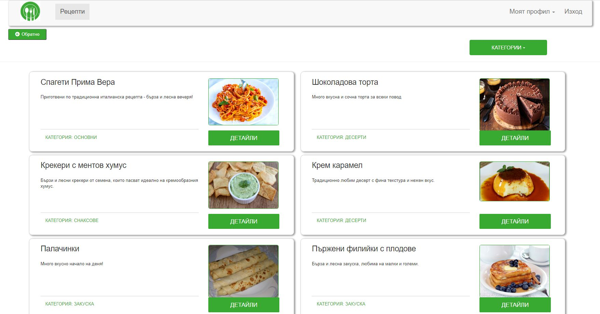
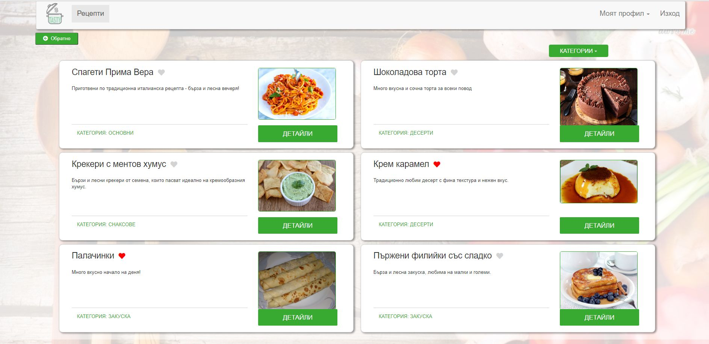

# TheTastyPlace app

(Exam project) 
The Tasty PLace is an app where every user can create, edit and delete his own recipes, view others and make personal Favorites List


## Install

/Execute from project root directory/

Install project dependencies:
```
npm install
```
Start the app:
```
ng serve
```

Open in browser:
```
https://localhost:4200
```
## Basic dependencies
* Use Firebase as a database and REST api services
* Use Angular for front-end


